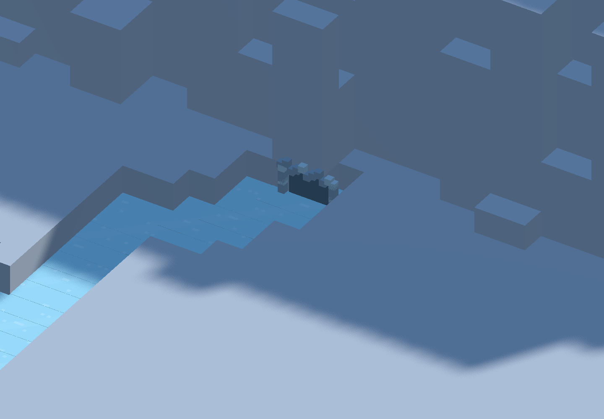
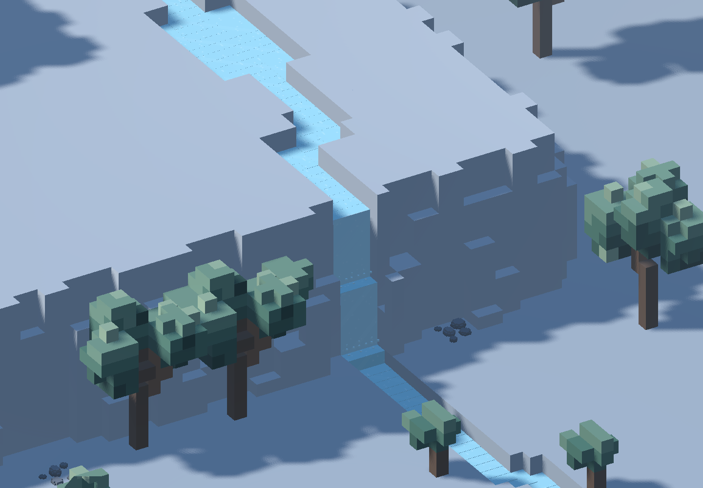
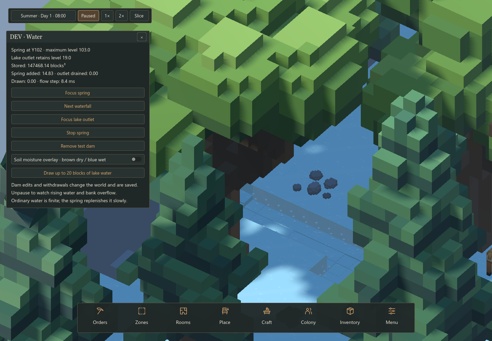

# 105 — Spring-fed Rivers, Finite Water & Flooding

Implemented 2026-10-10 from the approved water design in [33](../30_simulation_systems/33_water_simulation.md).

## Player-visible behavior

Every new landscape has a high rock spring and a downhill river to its main lake.
The seeded route includes quiet collection reaches, small pools and waterfalls.
The old optional tarn is a finite basin, not a required or magical water source.
The protected Y115 summit and bedrock remain intact.

Stored water is finite. Only the rate-limited spring adds water; submerging its
mouth stops discharge. A lakebed dry stone removes water only above the retained lake level.
Terrain obstructions cause upstream water to rise, spread over lower banks and
find another route. Excavating below stored water can flood the opening. Terrain
solids obstruct flow; furniture and doors are not currently watertight barriers.

Standing water prevents new land navigation/placement. Flooding does not apply
drowning, crop damage, floating-goods behavior or automatic plant removal.
Existing plants also survive loading a flooded world.

**Terrace-spill correction (2026-10-10):** user seeds `474028005` and `1630876908`
exposed unwanted spreading beside waterfalls. Free overfalls now prefer the
lowest receiving surface. Channel carving checks the actual detailed dry banks,
propagates lower cuts downstream, and widens waterfall landings into plunge pools.
Water less than 1/16 block deep remains conserved but appears as damp ground;
it does not block navigation/placement or create falling curtains, splashes or audio.
The renderer uses the same outlet selection as the solver.

**Initial dry-stone appearance correction (2026-10-10), superseded by
[109 — Loose water stones](109_loose_water_stones.md):** the user rejected the decorative
shoreline opening. It is removed entirely. One muted blue-gray `dry_stone` terrain
voxel replaces the existing lakebed block directly below the outlet intake.
Normal terrain geometry, lighting, picking and slicing apply; opaque water hides
it while submerged. The retained level remains Y19 and drainage remains capped
at 8 blocks³/s. Neither the solid/air layout nor initial stored volume changes,
so this material/presentation change does not change the water-layout version.
`DryStoneTest` verifies three generated worlds, one solid voxel, agreement between
overview and authoritative terrain, the submerged intake, fixed-stone mining
protection, retained lake volume and exact save/load continuation. Native captures
in `tmp/water_review/dry_stone/` show the clean shoreline and the real stone after
a temporary test-only drawdown. `WorldTerrainStartupTest` passes all 1,024 tiles,
slicing and scene save/reload; no terrain coverage regression.

This changes generated river beds (**water layout version 2**). Restart Play and
start a new world. Earlier development-water saves are rejected rather than loading
their deltas onto the changed terrain; no migration is provided.

**Wider river and unified appearance (2026-10-10):** ordinary reaches now use a
two-cell radius (about five voxels across), retaining the small spring mouth and
occasional short narrows. Quiet pools and waterfall landings remain wider. The
same bank containment and downhill-carving passes apply to the expanded footprint.
All water now shares one blue-green color and surface animation, with a subtle
12% maximum depth shade; the old contrasting shallow/deep palette is removed.
That widening introduced water layout version 3. [106 — Spring caves and water
edges](106_spring_caves_and_water_edges.md), including its outlet correction, now uses **water layout version 5**
and needs a new world.
The user's seed `2544080684` grows from 1,880 to 2,523 river columns (34%).
That seed, both earlier flood-report seeds and seed 42 passed five-game-hour
stability runs with no detected off-channel water. Dam/continuation integration,
save/backup recovery (148 malformed snapshots), all 32 fallback layouts and native
previews also passed; see `tmp/water_review/width_*.log`.

[River–lake junction preview](../../tmp/water_review/wider_junction.png) ·
[Wider reach preview](../../tmp/water_review/wider_reach.png)

Soil beside water gradually becomes damp, with weaker coverage out to three
cells of Manhattan distance at the root elevation. Initial tuning: two game
hours to wet, 24 to dry. Damp shading and a brown-to-blue moisture overlay expose
the coverage. Crop jobs and production requirements remain a separate feature.

Water uses flat fractional surfaces, voxel shorelines, square highlights,
block-shaped splashes and local waterfall audio on the shared work sound bus.
Water curtains are offset from cliff faces to avoid flicker. Opaque water,
discovery checks, slicing and the existing underground lighting shader preserve
resource concealment.

## Try it

1. **Project → Reload Current Project**, because `WaterManager` is a new autoload.
2. Start a new world. Development saves predating this owner/layout have no migration.
3. Open **Menu → Development → DEV: Water**.
4. Focus the spring, cycle waterfalls, or focus the outlet. Stop/restart the spring.
5. Build the test dam and unpause to observe accumulation and bank overflow;
   remove it to reopen the channel. This uses real, saved terrain edits and avoids
   occupied colony cells. It is an inspection tool, not a finished construction job.
6. Try a measured lake withdrawal and the soil moisture overlay.

## Implementation

- `RiverLayout`: deterministic reverse route search from the lake, with a source
  selected next to an upper rock face. Authoritative channel cuts happen after
  macro validation and before cave placement. Shallow initial river reaches have
  a hydraulic gradient so the spring can begin supplying them immediately.
- `WaterFlow`: conservative volumes in solid-separated vertical spaces. A column
  can have surface water and underground pools. Local sill transfers and bounded
  level sharing within already-wet flat reaches handle reservoirs without
  processing every voxel. Dry gaps, higher sills and terrain barriers stop reach
  sharing. No pressurized pipe network is implemented.
- Quantities use **integer millionths of a block cubed**; simulation clocks use
  integer microseconds. JSON cannot round those small values into divergent flow.
  Transfer/displacement conserve volume; spring input, outlet loss and measured
  extraction have separate accounting.
- Quiet lakes sleep. Each 0.1-second tick processes at most 384 active spaces;
  rendering rebuilds at most three dirty 32×32 water tiles per frame. Navigation
  invalidation follows wet/dry voxel boundaries rather than every fractional change.
- `SoilMoisture` keeps a sparse analytic history separate from water volume.
  Queries/rendering cannot advance its state. Standing-water seepage currently
  changes moisture without charging an agricultural consumption rate.
- `WorldData.get_live_block` provides dynamic occupancy even outside streamed
  chunks; `get_terrain_block` supplies raw terrain with a deterministic fallback.
  Edits are reapplied if a late generated chunk arrives. Positive solid edits have
  a batched terrain mesh; mining keeps its existing discovery/cavity pipeline.
- `WaterManager.extract(cell, requested)` returns only available measured water.
  Physical containers, hauling reservations, brewery storage and recipe inputs
  are deliberately left to the planned production jobs; this API invents no goods.
- Save owner `water`, priority 11 after mining: volume deltas, active queue,
  displaced water, source/outlet switches, exact time, moisture history and solid
  terrain edits. Current-save validation rejects malformed, negative, duplicated
  or out-of-bounds water records and unknown terrain keys before world mutation.

Configuration is owned by WorldGenerator in `data/world_gen/water.json`.
Source throughput, hydraulic conductance, irrigation and visual/audio settings
are initial values for playtesting.

## Validation and native review

- `WaterFlowTest`: conservation, equal levels, dam overflow, no flow above supplying
  head, submerged-source shutoff, protected outlet, cave breach, solid displacement,
  exact future flow after JSON, gradual wetting/drying and read-only moisture queries.
  Includes rotated free-waterfall/side-terrace cases and blocked-outlet overflow.
- `WaterStabilityTest`: both reported worlds plus seeds 1234/42, each run untouched
  for five game hours at the normal work budget. Checks actual bank clearance,
  unintended spill volume, standing-water depth, conservation and navigation across
  film/standing-water/drained thresholds.
- `WaterWorldTest`: eight seeded routes, live source/withdrawal/navigation, clock
  pause/speed, exact future continuation, real terrain dam overflow and lake breach.
  `-- --fallbacks` exercises all 32 macro fallback layouts, including rock-face
  source placement and protected summit columns.
  The dam regression uses measured upstream inflow to isolate obstruction/overflow
  from the distant spring's travel time; the untouched controls cover natural supply.
- `SaveManagerRoundTripTest`: populated colony plus changed finite water, a stopped
  source, a solid dam and exact measured withdrawal; manual/autosave and corrupt or
  structurally invalid primary-file backup recovery, including obsolete water layouts.
- Existing native underground-lighting and ladder-mining regressions pass.
- `WaterPresentationTest`: native spring, waterfall, outlet, dam, damp-soil/overlay
  and development-control captures in `tmp/water_review/`. Native lighting/fog
  and voxel geometry were inspected. The test uses isolated application-data paths.
- `WaterFloodPresentationTest`: native views of both reported spill locations after
  90 simulation seconds; `tmp/water_review/fixed_474028005.png` and
  `fixed_1630876908.png`. Film treatment and standing water share a single threshold.

Final correction checks: all four stability worlds completed with zero detected
off-channel water; the measured-inflow dam flooded 35 dry columns while conserving
volume. Flow, eight-route integration, all 32 fallback routes and the full save/backup
test passed (148 malformed snapshots). Logs are `tmp/water_review/final_*.log`.

