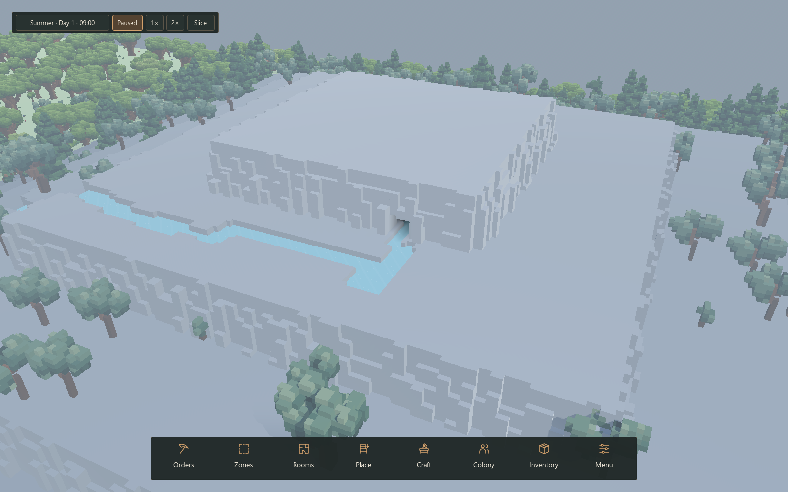
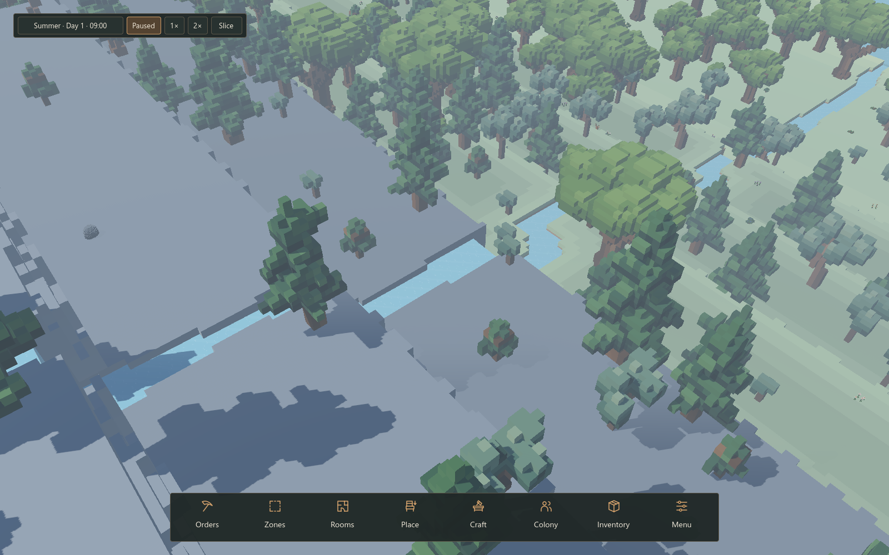
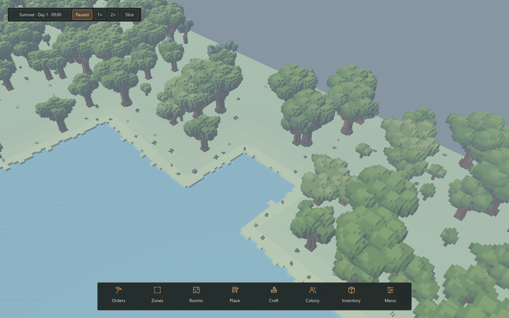
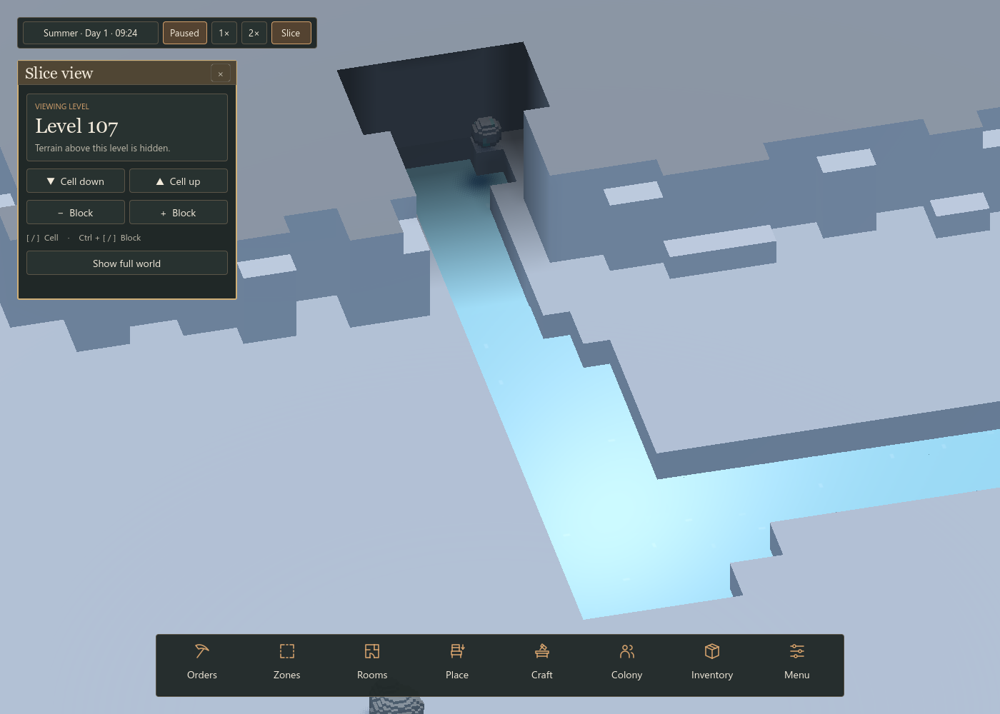

# 106 — Spring caves and water edges

User-approved implementation, 2026-10-10, following [105](105_rivers_and_water.md).

## Result

The high spring now emerges from real generated cave air. Its passage has a
three-cell stream, raised dry rock ledges and a small wider collection pool at
the back. The chamber is normally 8–10 cells into the mountain; the planner can
extend it behind rough cliff ledges to retain a solid roof. Terrain blocks define
all walls, floors and roof. The decorative black spring panel is removed.

The wet stone rests on the dry ledge beside the back pool. Its loose ore-shaped
model supersedes the original four embedded turquoise terrain blocks; see
[109](109_loose_water_stones.md). The source supplies the same open water space
at the existing rate and discharge cap.
Backing up the chamber submerges the source; reopening its mouth drains water
and permits replenishment. Ordinary rock around it remains editable. The stone
is a world model with no terrain occupancy or mining yield.

The exposed spring cave is revealed from generation, reconstructed on load,
and participates in the same cavity-shell, slice, picking, navigation and lighting
paths as discovered caves. Other enclosed caves keep their discovery rules and
are reserved away from this footprint. Daylight follows the physical entrance;
deeper space needs ordinary local light. Water is not treated as a solid roof by
the lighting field.

Water tops remain flat and voxel edged. Previously omitted sub-0.002-block step
faces now close the mesh. Steps below 1/8 block use top-surface shading instead
of dark vertical-wall shading. Larger drops keep their directional faces and
waterfall effects. The presentation change does not alter stored water volume.

## Implementation

- `SpringCaveLayout` supplies deterministic spans, ledges, initial water and stones.
- `WorldGenerator` integrates them with the normal cave catalog and block lookup;
  `CaveLayout` excludes that reserved footprint from enclosed systems.
- `WaterManager` seeds underground volume and merges cave/outdoor spans at the
  mouth. Source position is inside; its unchanged maximum head remains outside.
- `InteriorTracker`, `WorldRenderer` and `UndergroundLighting` derive exposure
  and daylight on initial generation and reload, without fake mining deltas.
- `WaterRenderer` closes small interfaces and keeps their lighting continuous.
- DEV Water's spring focus targets the entrance; Slice exposes the interior.

This changes generated terrain and initial volumes: **water layout version 4**.
Restart Play and create a fresh development world. Older saves are rejected;
there is no development-save migration. No global class or autoload was added.

## Verification

Regression scripts: `SpringCaveTest`, `WaterSurfaceMeshTest`, `WaterStabilityTest`,
`WaterWorldTest`, `SaveManagerRoundTripTest` and `UndergroundLightingTest`.
Recorded results and native captures are kept in `tmp/water_review/`.

- Eight detailed worlds: deterministic air/roof geometry, supported wet-stone placement,
  dry ledge routes, outside-bank access, open source-to-river water connections
  and enclosed-cave concealment pass (`cave_connectivity.log`).
  Two rough cliff lips required extending the ledges one cell toward the river.
- Source chamber: actual mouth blockage raises water to the source cap; adding
  at a fully submerged discharge returns zero. Reopening restores flow. Mining
  beside the pool fills the excavation. Measured volume and saved future agree.
- Four five-game-hour controls (2544080684, 474028005, 1630876908, 1234): no
  unintended off-channel standing water or leakage. The three worlds affected
  by the final approach pass were rechecked in `cave_approach_stability.log`.
- Eight ordinary and 32 fallback macro routes retain covered source chambers.
  A real downstream dam floods 36 previously dry columns and conserves volume.
- Mesh regression closes a sub-0.002-block interface across a tile boundary,
  retains surface lighting and genuine waterfall faces, and leaves water state
  unchanged (`mesh_test3.log`).
- Full colony save/load, autosave and backup recovery pass, with 148 malformed
  snapshots rejected (`cave_save_verified.log`). Editor import and diff checks pass.
- Native lighting regression passes: roofs, doors, skylights, stacked floors,
  local lights and replayed mining (`cave_lighting3.log`). The earlier cave
  previews (`cave_preview_sky.log`) missed incomplete terrain outside the cave's
  two tiles. Their successful completion did not validate whole-world rendering.

## Whole-world terrain regression and correction

The exposed cave queued local overview updates before the first terrain build.
Startup incorrectly used an empty dirty queue to decide whether it needed to
schedule the whole world. It built only the two cave tiles, then marked the
overview complete. Trees and water rendered independently, leaving them floating
over missing terrain across the map. The generated terrain data remained intact.

`WorldRenderer` now tracks initial full-world scheduling independently of local
dirty work. Global invalidation resets that state; a local refresh preserves it.
Pending save slices still apply before the full queue is built, and cave cuts are
retained. This is a rendering fix; layout version 4 and terrain data are unchanged.
Restart Play to use the corrected renderer; current-version saves can be loaded.

`WorldTerrainStartupTest` reproduces the original failure (2/1024 tiles) on the
reported seed 2795346874. After the fix, that seed and 2544080684 pass checks for
visible geometry in every tile after startup, local refresh, slicing, real
SaveManager reload, leaving slice view, and global invalidation immediately
followed by a local update. A distant mesh remains unchanged during local refresh.
Native captures use the gameplay camera and actual sky after full coverage is
verified. See `terrain_startup_before.log`, `terrain_startup_fixed.log`,
`terrain_startup_second.log`, and `terrain_startup_native.log` in `tmp/water_review`.

## Spring outlet alignment correction

Seed `1675083273` began its river with a sideways step directly against the cave
approach ledges. The water spaces were connected, but one stream lane ran into
the bank two cells outside the cave. The raised lip obscured the narrower
connection from the player's camera angle, making it look disconnected.

`RiverLayout` now keeps the first four outlet cells on the cave axis, then joins
the original seeded route. The existing bank/depth planning runs on that aligned
footprint. `SpringCaveLayout` also clears the three stream lanes through rough
cliff lips beside the mouth without removing the roof or raising downstream beds.
The dry access ledges, stones and water solver keep their existing behavior.

This changes terrain and initial volume, so the current water layout is **version
5**. Start a fresh development world; older saves are rejected without migration.
`SpringCaveTest` now checks each outlet lane for wet, downhill clearance in
addition to the existing source-to-river connectivity and dry access checks.
The added regression fails on the reported seed before the fix.

Verification in `tmp/water_review/spring_gap_*.log`:

- Nine detailed cave layouts pass all outlet lanes, dry access, source support,
  roof, discovery and connectivity checks (`geometry_final`).
- Eight ordinary and 32 fallback routes remain downhill and preserve the summit
  (`world`, `fallback`). A real dam still floods; lake breaches conserve volume.
- The reported seed is checked in the native renderer at several camera angles,
  initially and after 1,000 water steps, with and without slice view (`after`).
- All 1,024 terrain tiles retain geometry through startup, slicing, save/reload
  and local/global rebuilds on the reported seed (`startup`).
- Sealing/reopening the cave still respects the source cap and restores supply;
  water continues identically after JSON save/load (`sealed`).
- Four five-game-hour controls show no off-channel standing water or leakage:
  the reported seed (`stability`) and 474028005, 1630876908, 2544080684
  (`stability_final`).
- Full colony save/load and backup recovery pass, with 154 malformed snapshots
  rejected, including the previous water layout (`save`). Editor import and
  whitespace checks pass.

