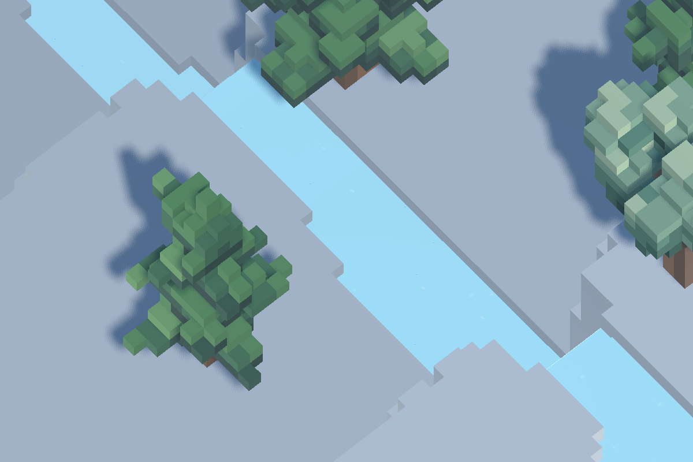
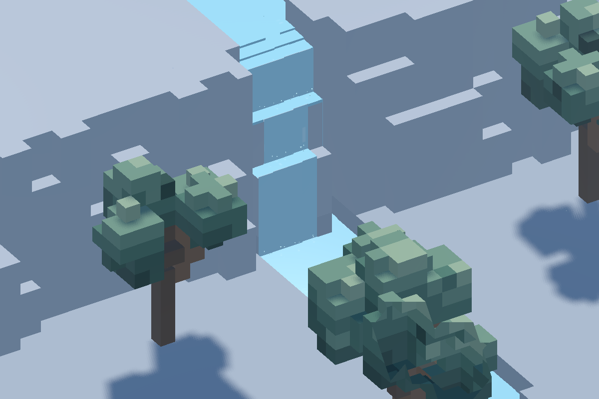

# 107 — Water appearance

Implemented 2026-10-10 after the user's approval of all five appearance changes.

## Appearance

- Removed the global diagonal scrolling and repeating pale bands/chevrons.
  Small square and rectangular highlights have varied positions and lifetimes.
- River highlights follow measured local currents, including bends and reversed
  flow. Quiet water shimmers in place. Currents fade as a blocked reach settles.
- Lakes, rivers and cave pools retain the shared blue-green/depth palette and
  normal sky, shadow, underground-light and fog response. Gloss is restrained.
- Real falling faces have downward streaks. Small broken foam patches are confined
  to wet waterfall lips and landing cells. Cube splashes have varied phases,
  directions and heights, and fade out when current stops.
- Surface detail fades with projected pixel size and viewing distance. Distant
  splashes are culled; surfaces retain flat voxel geometry and closed tiny steps.

## Ownership

`WaterFlow` optionally records horizontal transfer totals, including the implicit
interface transfers in its conservative wet-reach equalization. This telemetry
does not participate in water decisions, mass accounting, queues or serialization.

`WaterSurfaceMotion` consumes those totals about every 0.2 simulation seconds,
smooths local velocities and maps them to restrained visual speeds. The sparse
current field fades to zero without continuing transfer. GPU data uses a compact
lookup texture indexed by the full water-space key, keeping stacked underground
and surface pools separate. It does not require terrain or water mesh rebuilds
just to animate currents. State resets on initialization/restoration.

`WaterRenderer` attaches that lookup index and surface/fall/foam kind to each
quad. The shared lighting shader crossfades short advection phases, avoiding
unbounded texture displacement as direction or speed changes. Calm surfaces use
stationary marks whose brightness changes independently. All motion uses the
water simulation clock, respecting pause and game speed.

No new save fields, water-layout version, terrain generation or hydrology rules.
Restart Play for the new scripts/shader; current-version saves remain usable.

## Verification

- `WaterSurfaceMotionTest`: currents turn through bends in all four orientations;
  sealed reaches become quiet; equalization reports reverse motion; stacked pools
  have separate indices. Enabling telemetry produces exactly the same serialized
  solver state as a control. JSON restoration preserves future volume/queues.
- `WaterFlowTest` and `WaterSurfaceMeshTest`: conservation, flooding, source caps,
  water extraction, restoration, watertight tile edges and true falls pass.
- `WorldTerrainStartupTest`: all 1,024 tiles have visible geometry after startup,
  local refresh, slicing, save/load and global invalidation.
- `SaveManagerRoundTripTest`: full colony, weather, finite water, autosave and
  backup recovery pass. `WaterWorldTest`: actual dam overflow and excavation
  flooding preserve measured volume and clock-speed behavior.
- Native lighting regression: no failures for roof, entrance, door, torch,
  stacked-level and replay checks after the shared shader change.
- Native generated world 2795346874: bend, falls, lake, distant water and actual
  dev dam recorded at 10 frames/second. Pause keeps the water shader clock fixed;
  full terrain coverage is checked before capture. Current-field update measured
  7.1 ms for roughly 4,400 active entries/22,061 registered spaces in this debug
  capture; updates run at five per simulation second, not every rendered frame.

Logs: `tmp/water_review/motion_test.log`, `appearance_native_final.log`,
`appearance_*Test.log`, and `appearance_lighting.log`.

Clips: [River bend](../../tmp/water_review/appearance/bend.mp4),
[waterfalls](../../tmp/water_review/appearance/falls.mp4),
[lake](../../tmp/water_review/appearance/lake.mp4),
[distant view](../../tmp/water_review/appearance/distant.mp4),
[blocked channel](../../tmp/water_review/appearance/dam.mp4).

