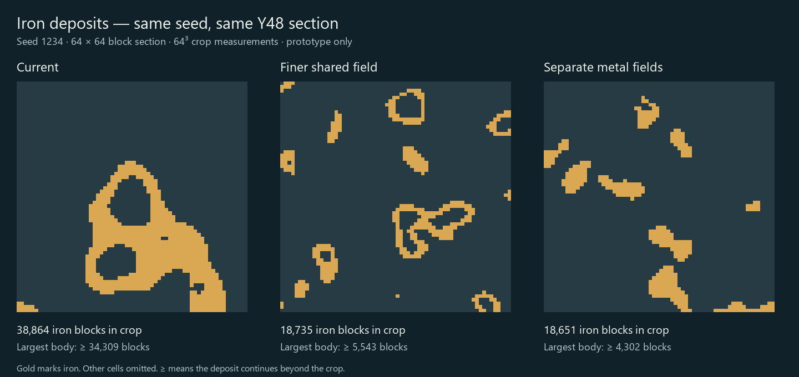

# 70 — Ore vein prototypes

Completed 2026-10-08 after [69 — Resource distribution review](69_resource_distribution_review.md).
The user approved comparing smaller deposits before changing live generation.
This study adds offline tools and measured review material only. Production
world generation, resource depth bands, gems, priority and drop rates are unchanged.

**Subsequent integration:** the user accepted the separate-field direction.
[71 — Independent ore fields](71_independent_ore_fields.md) records the live
implementation, expanded calibration and eight new check seeds. The results
below preserve the original prototype comparison. The study tool now explicitly
reconstructs its frozen shared-field baseline; its `current` label refers to the
pre-integration generation reviewed here.

## Three options

| Option | Ore field | Purpose |
|---|---|---|
| Current | Shared field, frequency 0.02 | Actual generated blocks as the baseline |
| Finer shared field | Shared field, frequency 0.05 | Smaller features with the existing thresholds and nested selection |
| Separate metal fields | Independent fields, frequencies below | More distinct metal patches while retaining broad coal |

All prototype fields retain the current two noise octaves. Separate fields still
resolve overlaps in the current gold → silver → iron → copper → tin → coal order.
The different shapes do not introduce horizontal mountain bias or change depth
windows. Coal retains frequency 0.02 and seed offset 1.

| Resource | Separate-field frequency | Seed offset | Fitted cutoff, rounded |
|---|---:|---:|---:|
| Gold | 0.065 | 101 | 0.841097 |
| Silver | 0.065 | 211 | 0.807310 |
| Iron | 0.055 | 307 | 0.703428 |
| Copper | 0.060 | 401 | 0.704834 |
| Tin | 0.070 | 503 | 0.731389 |
| Coal | 0.020 | 1 | 0.664477 |

These cutoffs belong to independent fields. Their order is not a valid replacement
for the descending cutoffs required by the current shared production field.
Exact fitted values are saved in the study report.

## Method and limits

- Seeds: **7, 1234, 65535, 20261007, 3381051336, 4294967295, 314159265,
  2147483647**. The first four calibrate one global cutoff per resource; the final
  four are held out from fitting. There is no per-seed or per-crop fitting.
- Cutoffs match each resource's aggregate current count on the four calibration
  seeds after higher-priority resources claim their cells. This isolates shape
  changes without deliberately cutting the training sample's ore supply.
- Abundance uses the same **3,662,272 underground sample cells** as doc 69:
  x/z 4,12,…,1020 and every Y4 through solid terrain height. These are sample
  counts, not full-world totals or an all-seed guarantee.
- Every option uses the same generated terrain, rough natural cliffs/shores,
  cave air, resource protection rules, depth windows and existing gem exclusions.
  This is an ore-mask comparison, not a replacement full-material generator.
- Each seed also exports one dense **64³** box starting at Y12 under the same
  first qualifying Y115 macro-cell center used in doc 69. All three options use
  identical crop coordinates. Views can show horizontal Y or vertical Z sections.
- Six-neighbor components measure connected blocks of the **same ore**. A
  component touching a crop boundary is clipped: its count is a lower bound on
  the full deposit. The images omit non-ore cells, including rock, gems and air.
- Independent noise does not impose a strict maximum deposit size. Neighboring
  features can still join, and these relatively small samples do not establish
  whole-world deposit-size distributions or player excavation effort.

## Results

| Resource | Current sample | Finer shared sample | Separate sample | Separate change on held-out seeds |
|---|---:|---:|---:|---:|
| Gold | 6,894 | 6,800 | 6,366 | −14.55% |
| Silver | 12,956 | 11,315 | 12,456 | −7.45% |
| Iron | 98,764 | 92,133 | 98,937 | +0.35% |
| Copper | 39,485 | 39,644 | 40,330 | +4.41% |
| Tin | 14,597 | 14,140 | 15,771 | +17.48% |
| Coal | 220,202 | 213,529 | 221,780 | +1.43% |
| **Total** | **392,898** | **377,561** | **395,640** | — |

Across all eight seeds, finer shared reduces sampled ore by **3.90%**; separate
fields increase it by **0.70%**. The close overall total hides resource-specific
variation, particularly gold and tin on the held-out seeds.

The following values are the **median of the largest connected component in each
of eight crops**, not median vein sizes. Clipped components remain lower bounds.
Zero-resource crops contribute zero; this particularly limits gold comparisons.

| Resource | Current | Finer shared | Separate fields |
|---|---:|---:|---:|
| Gold | 43.5 | 175.5 | 107.5 |
| Silver | 1,017.5 | 297.5 | 209.5 |
| Iron | 14,651.5 | 4,736 | 3,259 |
| Copper | 10,641.5 | 1,703 | 2,223 |
| Tin | 1,926 | 83 | 501 |
| Coal | 26,159 | 18,528.5 | 32,354 |

The finer shared field shrinks the same nested bands: visible rings/shells remain,
and tin becomes particularly fragmented. Separate fields produce more distinct
patches and substantially smaller sampled iron/copper bodies. Coal remains broad
and can connect into larger bodies than the current option. Gold is not uniformly
smaller in these crops.



In that example the current crop's largest iron body has at least **34,309**
blocks, versus **5,543** for finer shared and **4,302** for separate fields. All
three touch the crop boundary. The section shows only one plane of each 64³ box.

## Recommendation and next decision

Review **separate metal fields with broader coal** as the preferred direction.
It makes metal shapes more distinct without substantially changing aggregate
sampled ore. It is still a prototype: deposits can contain thousands of blocks,
and gold/tin abundance needs review before selecting final parameters.

After the user chooses a shape direction, plan its production integration and
agree on the desired deposit scale. Extend abundance checks to additional seeds
and depths, then verify streaming, cave exposure and slice concealment using the
actual integrated generator. Keep horizontal resource bias and temporary item
drop probabilities as separate design decisions. No new pattern is live yet.

## Tools, evidence and verification

- `tools/OreVeinStudy.gd`: standalone Godot entry point, owning its offline study
  configuration and exports; not imported by the live game.
- `tools/ore_vein_study/profiles.json`: seed list and candidate field settings.
- `tools/ore_vein_study/analyze.py`: component measurements and baseline comparison.
- `tools/ore_vein_study/render.py` and `comparison.template.html`: measured static
  reference and self-contained interactive comparison, including all eight crops.
- [Study report](../../tmp/ore_vein_review/study.json),
  [component analysis](../../tmp/ore_vein_review/analysis.json) and
  [Godot log](../../tmp/ore_vein_review/study.log).

The Godot study passed with no script errors. Fresh noise instances reproduce
sampled selections and depth/protection checks pass. Analysis verifies all eight
current crops' ore totals/largest components and geography fingerprints against
the previous resource audit. Current world sample counts also match that audit.
SHA256 checks preserve the live generator, cave component and terrain/resource
profiles. The comparison's seed, resource, orientation and section controls were
checked in-browser; the narrow layout stacks the maps without content overflow.

To reproduce from the project root (Python requires NumPy and Pillow):

```powershell
$env:APPDATA = 'P:\Deepdraft\tmp\ore_vein_review\appdata_study'
$env:LOCALAPPDATA = 'P:\Deepdraft\tmp\ore_vein_review\localappdata_study'
$oreRun = Start-Process -FilePath 'S:\STEAM\steamapps\common\Godot Engine\godot.windows.opt.tools.64.exe' -WindowStyle Hidden -Wait -PassThru -ArgumentList '--headless --path P:\Deepdraft --log-file P:\Deepdraft\tmp\ore_vein_review\study.log --script res://tools/OreVeinStudy.gd'
if ($oreRun.ExitCode -ne 0) { throw 'Ore prototype study failed; inspect the log.' }
Select-String -Path tmp/ore_vein_review/study.log -Pattern 'SCRIPT ERROR|ERROR:|\bFAIL\b'
python tools/ore_vein_study/analyze.py
python tools/ore_vein_study/render.py tmp/ore_vein_review/comparison.html
```

Dense binary exports use byte order `[Y,Z,X]`, with codes 1–6 matching the resource
order above and 0 for omitted cells. Calibration-point files and isolated user-data
directories are ignored; the reports and dense crops preserve the review evidence.
